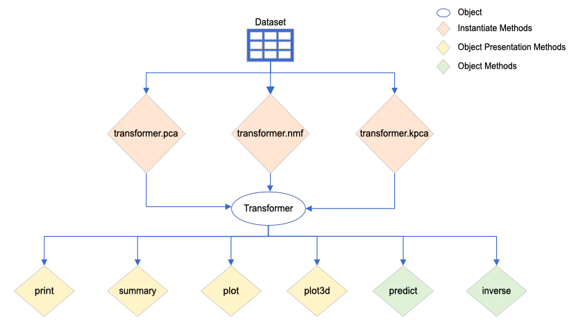
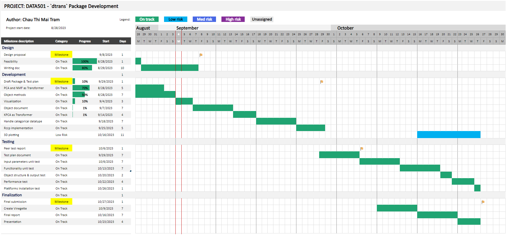

```{r setup, include=FALSE}
knitr::opts_chunk$set(echo = TRUE)
```

\newpage

# 1. Introduction

## 1.1. Motivation

Visualization is one of the first important steps to understand the pattern of dataset before proceeding to the further task of analyzing and modelling. It is challenging to visualize very high dimensional data which has become common in today's fast development in terms of computation and storage. Features engineering proposes the approach in selecting a subset of high correlated dimensions. However, selecting 2 or 3 features from a high-dimensional data (which may be hundreds of features) is not a good option for the very first step of understanding the dataset. In this case, the data transformation techniques should be considered as an alternative approach. Data transformation does not remove explicitly any feature from data but incorporates all features into components. This reduces the high number of features into a lower number of derived components while as much information as possible remains.

This package will incorporate 3 existing transformation algorithms in CRAN R in separate packages. They are Principal Component Analysis (PCA), Kernel PCA and Non-Negative Matrix Factorization (NMF). I have the intention to provide a single interface for the end user to transform data by these 3 algorithms, this is the main idea of the main object of the package named Transformer. In addition, six functionality methods are developed supporting for viewing, plotting, predicting new data and inversing data from the object. Therefore, this package provides an easy approach to different transformation algorithms through a single interface and an easy start without previous algorithm background by the default parameters setting. Users are able to visualize the results easily before diving into the algorithms’ mechanism. Moreover, users can easily interchange between techniques and compare the results to explore the different angle to the data and possibly spot on the most suitable technique for a specific data. 

## 1.2. Algorithms

PCA was first introduced by Karl Pearson’s in 1901 @pca. It is the simplest and the most widely used for dimensionality reduction. PCA transforms data into a new coordinate system which captures the highest data variance called the first component and repeats that process for the following ordered component. So, the components’ orders indicate their important order to explain the data. For example, when we transform a 10 features dataset to a 2-components dataset which can capture a high percentage of variance of around 80 or 90%; the variance indicates the difference among data points based on 10 features, so we can visualize these data point in a x-y coordinate to analyze them.

Kernel PCA was first introduced by Schölkopf et al. in 1998 @kpca, it is an extension of PCA allowing for nonlinear dimensionality reduction. Standard PCA uses linear projection, Kernel PCA uses kernel trick – projecting the non-linear-separated data into the linearly separated one in a higher dimensional space. 

NMF was first introduced by Paatero and Tapper in 1994 @nmf. It is also a common technique for dimensionality reduction. This method reduces the number of features into a smaller number of components which are partly explaining the dataset. As the name indicated, it is applied for positive values data. In practice, it is more suitable for the data combined from different sources, or different layers in datasets, e.g. wave data with multiple sources, music track recorded several instruments.

t-distributed Stochastic Neighbor Embedding (t-SNE) was first introduced by Laurens van der Maaten and Geoffrey Hinton in 2008 @tsne. It is a dimensionality reduction method mostly for visualization, rather than feature reduction pre-processing data. This method computes the new representation of the dataset by preserving the distance between data points as best as possible. In other words, it tries to preserve the probability distribution in low dimensional space. It is proposed in the Proposal document, however, during the feasibility research phrase, t-SNE does not fit well to the object Transformer for several reasons: 

* It is not feasible to standardize the t-SNE output to the Transformer object, in a way the other 3 techniques do. 
* t-SNE algorithm does not provide enough attributes to support post-fit methods of the Transformer object (prediction and inverse methods) .
* The algorithm referenced includes multiple parameters inside the method definition, they are not explicitly defined as input parameters. It would be too complicated to allow the user to adjust these parameters but hiding them from users would hinder many aspects of the output which users are not able to control and explain. 

## 1.3. Scope

*In Scope:*

* Main default algorithms for each technique will be developed include: PCA, Kernel PCA, and NMF. 
* Handling categorical data.
* Visualization for the transformed data.

*Out of Scope:*

* Variants of the algorithms.
* Data cleaning.
* t-SNE algorithm.
  
# 2. Design Description

The algorithm for PCA, NMF, Kernel PCA are referenced from existing R Packages available in base R and CRAN website

* stats::prcomp by R Core Team and contributors worldwide @stats.
* NMFN::nmf by Suhai (TImothy) Liu @nnmf.
* kernlab::kpca by Alexandros Karatzoglou @kernlab.

They are defined as methods to create the object called Transformer. The diagram shows the design for the object and methods developed in this package.



Starting from a dataset, it is used to create the Transformer object by one of 3 instantiate methods transformer.pca, transfomer.nmf, and transformer.kpca. After the object is created. It can be viewed or visualized by 4 object presentation methods – print, summary, plot, and plot3d. Furthermore, new data can be fitted to the existing object to be transformed, whereas the transformed data can be reversed back to the original given the object attributes. These two functionalities are defined in the two object methods – predict and inverse @pyml @pycookbook. 

## 2.1. Object

‘Transformer’ is the main object of the package. There are 3 techniques to transform data and create the Transformer object based on PCA, NMF and t-SNE algorithms. 

The object's attributes include: 

* x: data after transform, are calculated by the multiplication between the input variables and components’ coefficients. 
* coeff: describes how each component is a linear combination of the input variables.
* technique: pca, mnf, kpca.
* data: original data before being tranformed.
* prediction: list of attributes to support for predicting the new data based on this object. 

## 2.2. Instantiate methods 

There are 3 methods to create the Transformer corresponding to the 3 algorithms PCA, NMF and Kernel PCA: 

* transformer.pca 
* transformer.nmf 
* transformer.kpca 

with one mandatory input variable for the dataset to be transformed and a set of optional parameters: 

* Number of components: default to 2, which default for visualization. 
* Scaled components’ scores to the features’ value.
* Process categorical features option.

## 2.3. Object methods

*predict* method transforms the new data based on the transformer object. This function is helpful for pre-processing test data based on training data, avoiding leaking issues when evaluating the supervised learning model. It’s also helpful to transform new single data points based on the transformer object. 

*inverse* method computes the original features values based on the components to view how well or which part the components retain the information from the original features. It is helpful to explain the mechanism of the transformation on the dataset.

## 2.4. Object Presentation methods

*print* method provides the components’ coefficients, the percentage of variance presented by components, and the first 6 rows of transformed data. 

*summary* method provides the coefficients and statistical summary of transformed components. 

*plot* method plots transformed data. It depends on the number of components of object Transformer. 

* Number of components is at most two: plotting data points as scatter plots for one component (on y axis) or two components (on x and y axes).
* Number of components are greater than two: plot each pair of components in multiple subplots, using pairs plotting function.

*plot3d* method uses the plot function from rgl package with the interactive interface. 

## 2.5. Rcpp implementation

NMF algorithm is considered for Rcpp implementation. NMF algorithm is solving the nonlinear optimization problem, which minimizes the difference between the original data and the approximated transformed data through iteration @convergence. It depends on the data; it must loop through a certain number of iterations to convergence to the local minimum. This feature potentially reasonable for Rcpp implementation to speed up the high iterations scenario.

# 3. Data, Ethical and Legal

## 3.1. Data Requirement

Data input for these transformation techniques is in tabular format. 

Data features should be in numeric and discrete data type. The other data type would be implicit converted to numeric and discrete type and transformed. If there are errors about these data type conversions, there will be a message to indicate this. 

Package will process the discreate data by applying pre-processing data before applying the transformation. However, the user can manage this behavior by the parameter when initiating the object. If user opts for not handling discrete features, these discreate features are ignored with a message included in the output. 

## 3.2. Ethical and Legal 

This package implements the transformation algorithms without directly using any datasets for the development. However, code example and the vingette document use integrated dataset in dataset R package. There is no further ethical and legal concern relating to the data usage license for this package delivery.

Users may consider the impact of the after-transformed data for the specific scenarios. Would it be misled by the original meaning of the before-transformed dataset? The algorithms in the package try to retain as much information as possible with the limited components, it may leave out the edge case information, sometime these leave out information are noise, some other time, these are significant information of the dataset. The user should evaluate the usage for each scenario.  

# 4. Unit test plan 

* Validating input: checking the valid parameters for the functions and defining the output for the invalid parameters with the informative messages for errors and warning. 
* Checking the output of methods: checking the methods perform correctly as per input parameter.
* Check the object structure: checking the attribute of the Transformer object created by each algorithm, checking the structure of each attribute. 
* Checking the reference: as nmf algorithm returns different result in different run if there is no preset of random seed, if the random seed is set, it should return the same result with the runs having the same random seed. 
* Performance Test (algorithm accuracy) 
    * Comparing the result with the other packages support the same algorithms.
    * Comparing the result with algorithm which are implemented in other platform i.e. scikit-learn module in python, Orange application @orange.

# 5. Project Timeline 

There are 4 milestones corresponding to 4 due dates of 4 phrases i.e. design, development, peer testing and project finalization. The 3D plotting task is marked as low risk as it is low priority, it is a considered item to develop for the finalization submission. 



# 6. References

<div id="refs"></div>

